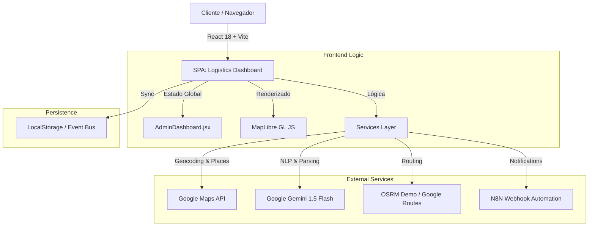

# 🛠️ Manual Técnico y de Arquitectura: Route Assigner

Este documento está dirigido a **desarrolladores, arquitectos de software y equipo técnico**.
Provee una disección profunda del código fuente, las decisiones de diseño, los algoritmos implementados y el flujo de datos de la aplicación **Route Assigner**.

---

## 1. 🏗️ Arquitectura del Sistema

### 1.1 Diagrama de Alto Nivel
El sistema sigue una arquitectura **Client-Side SPA (Single Page Application)**, minimizando la dependencia de un backend propio y delegando la lógica pesada a servicios especializados (Google Cloud, OSRM).



### 1.2 Stack Tecnológico
*   **Core:** React 18, Vite.
*   **Lenguaje:** JavaScript (ES6+), CSS Modules.
*   **Mapas:** MapLibre GL JS (Vector Tiles), Lucide React (Iconos).
*   **Servicios:**
    *   *Routing:* Google Directions API (Primary), OSRM (Fallback).
    *   *AI:* Gemini 1.5 Flash (via API REST).
    *   *Backend:* Vercel Serverless Functions (para endpoints seguros `/api/ejemplo`).

---

## 2. 📂 Estructura de Directorios y Modularización

El código está organizado bajo principios de **"Separation of Concerns"** (Separación de Responsabilidades).

### `/src/components` (Capa de Presentación)
*   **`AdminDashboard.jsx`**: **El Orquestador.**
    *   *Responsabilidad:* Maneja el estado "dueño de la verdad" (`waypoints`, `agents`).
    *   *Lógica Interactiva:* Escucha eventos de `localStorage` para actualizar el dashboard cuando un conductor completa una tarea en otra pestaña.
*   **`MapComponent.jsx`**: **El Visualizador.**
    *   *Responsabilidad:* Pura renderización de mapas. No manipula datos de negocio, solo recibe `props` y dibuja GeoJSON.
    *   *Técnica:* Usa `Refs` de React para mantener la instancia de MapLibre y evitar re-renderizados innecesarios.
*   **`Sidebar.jsx`**: **La Interfaz de Control.**
    *   *Responsabilidad:* Inputs de usuario, chat de IA, lista de paradas.
*   **`DriverView.jsx`**: **El Cliente Ligero.**
    *   *Diseño:* Zero-Backend. Lee toda la información de la ruta desde los parámetros de la URL (codificados en Base64). Esto permite que el link funcione "para siempre" sin consultar base de datos.

### `/src/utils` (Capa de Lógica/Servicios)
Esta carpeta contiene funciones puras y servicios "Agnósticos de UI".
*   `googleDirectionsService.js`: Contiene los algoritmos matemáticos (TSP, 2-Opt).
*   `geminiService.js`: Abstracción para hablar con la IA. Incluye el "System Prompt" que define la personalidad del bot.
*   `geocodingService.js`: Fasada para normalizar respuestas de diferentes proveedores de mapas.

---

## 3. 🧠 Algoritmos Críticos

### 3.1 Motor de Optimización (`googleDirectionsService.js`)
El sistema implementa un enfoque híbrido para el **Problema del Viajante (TSP - Traveling Salesman Problem)**.

#### A. Algoritmo Greedy (Vecino Más Cercano)
*   **Complejidad:** O(N²)
*   **Lógica:**
    ```javascript
    function nearestNeighbor(puntos) {
       actual = inicio;
       mientras queden_puntos:
          siguiente = buscar_mas_cercano(actual, puntos_restantes);
          ruta.push(siguiente);
          actual = siguiente;
    }
    ```
*   **Uso:** Rutas rápidas, visualización preliminar.

#### B. Algoritmo 2-Opt (Optimización Local)
*   **Lógica:** Iterativamente toma una ruta y verifica si "cruzar" dos aristas mejora la distancia total.
    *   *¿Es `dist(A,B) + dist(C,D)` mayor que `dist(A,C) + dist(B,D)`?* -> Si sí, intercambia las conexiones.
*   **Implementación:** Se ejecuta en bucles de hasta 100 iteraciones para refinar la solución del Greedy.

---

## 4. 🔄 Flujo de Datos y Sincronización

El sistema utiliza un bus de eventos basado en el navegador para simular "Real-Time" sin WebSockets.

1.  **Evento:** Conductor marca "Entrega Realizada" en `DriverView`.
2.  **Acción:** Se actualiza un objeto JSON en `localStorage`.
3.  **Disparador:** El navegador emite el evento nativo `storage`.
4.  **Reacción:** `AdminDashboard` captura el evento, recalcula métricas (`metricsService.calculateSummary`) y actualiza las gráficas sin recargar la página.

---

## 5. 🤖 Integración con Inteligencia Artificial

El módulo `geminiService.js` no solo "envía texto". Realiza una **Ingeniería de Prompts** estructurada.

*   **Input:** Texto libre del usuario ("Llevame a la 30 con 4").
*   **System Prompt:** "Eres un asistente de navegación. Tu salida debe ser SOLO un JSON válido con formato `{ action: 'add_coordinates', lat: ..., lng: ... }`".
*   **Output Parsing:** El frontend intercepta el JSON crudo, lo valida y ejecuta la función interna `setWaypoints`.

---

## 6. 🚀 Despliegue y CI/CD

El proyecto está configurado para **Vercel**.
*   **Archivo `vercel.json`:** Define las reglas de reescritura para que la SPA funcione en producción (evita errores 404 al recargar páginas internas).
    ```json
    {
      "rewrites": [{ "source": "/(.*)", "destination": "/index.html" }]
    }
    ```
*   **Variables de Entorno:**
    *   `VITE_GOOGLE_MAPS_API_KEY`: Crítica para mapas y geocodificación.
    *   `VITE_GEMINI_API_KEY`: Crítica para el chat.

---

## 7. 🛡️ Seguridad y Buenas Prácticas

1.  **API Keys:** Las llaves expuestas en el frontend (`VITE_...`) deben restringirse por **HTTP Referrer** (dominio web) en la consola de Google Cloud para evitar robos.
2.  **Validación de Inputs:** Todas las direcciones se pasan por el servicio de Geocodificación antes de ser coordenadas, previniendo inyección de datos corruptos.
3.  **Manejo de Errores:** Los servicios de mapas tienen "Fallbacks". Si Google falla, el sistema intenta degradarse elegantemente (aunque OSRM está configurado como respaldo teórico, la prioridad es Google).

---
*Documentación técnica generada para el equipo de desarrollo de Route Assigner.*
